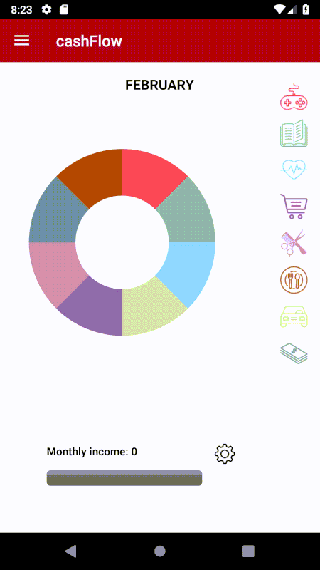

# CashFlow :money_with_wings: :money_with_wings: :money_with_wings:
Cash Flow is a money management / budget planner application that is intended to assist users in tracking and managing their everyday expenses. This application will keep track of every expenses made by users, separated by category for user to better track where their money go, and manage their expenses better. This app also keep track of user’s saving with added ‘Wishlist’ functionality, where users can list out items that they want to purchase outside of their daily expenses. ‘Wishlist’ is depending on savings functionality, this mean users can see how much savings they've accumulated, and if it’s enough to be used to purchase the items in the ‘Wishlist’.

---

## Description 
This repository contains source code for our Group Mini project of CSC577 Fundamental Software Engineering, FSKM UiTM Shah Alam. 
Our laboratory lecturer is Nordin Abu Bakar (Assoc. Prof. Dr.) and class lecturer is Mr Wan Ya bin Wan Hussin. The project has been presented to Dr. Nordin as needed by the course prior to the release.

## How to run
Install cashFlow.apk on your Android phone.

## Demo

	
---

### Group members
1. Faiz Ikhwan ([FaizIkhwan](https://github.com/FaizIkhwan "FaizIkhwan on GitHub")) - Developer
2. Shahrul Raimie ([shahrymie](https://github.com/shahrymie "shahrymie on GitHub")) - Designer
3. Muhammad Nur Hidayat ([MuhdNurHidayat](https://github.com/MuhdNurHidayat "MuhdNurHidayat on GitHub")) - GIF creator, Software tester

### Credits
This application uses Open Source components. We acknowledge and are grateful to these developers and artist for their contributions.

Special thanks to:
1. Pie Chart and Bar Chart made by [MPAndroidChart](https://github.com/PhilJay/MPAndroidChart) by [PhilJay](https://github.com/PhilJay) is licensed under the [Apache License 2.0](https://github.com/PhilJay/MPAndroidChart/blob/master/LICENSE)
2. Icons made by [Freepik](https://www.freepik.com) from [https://www.flaticon.com/](https://www.flaticon.com/) is licensed under [Creative Commons BY 3.0](https://creativecommons.org/licenses/by/3.0/)
3. Icons made by [Good Ware](https://www.flaticon.com/authors/good-ware) from [https://www.flaticon.com/](https://www.flaticon.com/) is licensed under [Creative Commons BY 3.0](https://creativecommons.org/licenses/by/3.0/)
4. Icons made by [Hanan](https://www.flaticon.com/authors/hanan) from [https://www.flaticon.com/](https://www.flaticon.com/) is licensed under [Creative Commons BY 3.0](https://creativecommons.org/licenses/by/3.0/)
5. Icons made by [Gregor Cresnar](https://www.flaticon.com/authors/gregor-cresnar) from [https://www.flaticon.com/](https://www.flaticon.com/) is licensed under [Creative Commons BY 3.0](https://creativecommons.org/licenses/by/3.0/)
6. Icons made by [mynamepong](https://www.flaticon.com/authors/mynamepong) from [https://www.flaticon.com/](https://www.flaticon.com/) is licensed under [Creative Commons BY 3.0](https://creativecommons.org/licenses/by/3.0/)
7. Icons made by [Zlatko Najdenovski](https://www.flaticon.com/authors/zlatko-najdenovski) from [https://www.flaticon.com/](https://www.flaticon.com/) is licensed under [Creative Commons BY 3.0](https://creativecommons.org/licenses/by/3.0/)
8. Icons made by [Kiranshastry](https://www.flaticon.com/authors/kiranshastry) from [https://www.flaticon.com/](https://www.flaticon.com/) is licensed under [Creative Commons BY 3.0](https://creativecommons.org/licenses/by/3.0/)
9. Icons made by [Pause08](https://www.flaticon.com/authors/pause08) from [https://www.flaticon.com/](https://www.flaticon.com/) is licensed under [Creative Commons BY 3.0](https://creativecommons.org/licenses/by/3.0/)
10. Icons made by [Smashicons](https://www.flaticon.com/authors/smashicons) from [https://www.flaticon.com/](https://www.flaticon.com/) is licensed under [Creative Commons BY 3.0](https://creativecommons.org/licenses/by/3.0/)

### License
The MIT License (MIT). Please see [License File](LICENSE.md) for more information.

